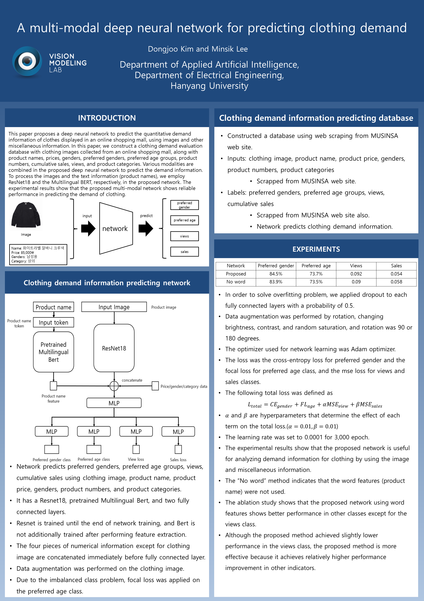

# A Multi-modal Deep Neural Network for Predicting Clothing Demand

**Authors:** Dongjoo Kim, Minsik Lee  
**Affiliation:** Department of Applied Artificial Intelligence, Department of Electrical Engineering, Hanyang University

Presented at [2022 Korean Institute of Electronics Engineers Autumn Conference](https://conf.theieie.org/2022f/)

## Overview

This project proposes a multi-modal deep neural network that combines visual and textual information to predict quantitative clothing demand (views and cumulative sales) from online shopping data. The model architecture integrates:

- **ResNet18** (pre-trained) for image feature extraction
- **Multilingual BERT** for product name encoding
- **Tabular metadata** (gender, price, category) for context
- **Multi-task learning** with 4 prediction heads:
  1. Preferred gender classification (3 classes)
  2. Preferred age group classification (7 classes)
  3. View count regression
  4. Cumulative sales regression

The dataset is constructed by web scraping the MUSINSA online shopping mall, combining product images, names, prices, and other metadata with scraped label information. For detailed architecture, loss functions, and implementation details, see [docs/SDD.md](docs/SDD.md).

## Repository Structure

```
kim2022multi/
├── README.md                    (this file)
├── LICENSE
├── .gitignore
├── requirements.txt
├── Materials/
│   ├── paper.pdf               (full paper)
│   ├── poster.png / poster.pdf  (conference poster)
│   ├── Additional experiment1.png    (training curves: accuracy)
│   └── Additional experiment2.png    (training curves: regression loss)
├── docs/
│   ├── SDD.md                  (Software Design Document — architecture, modules, data flow)
│   └── TC.md                   (Test Cases — 70+ assertions for validation)
└── src/
    ├── config.py               (hyperparameters: batch_size=64, num_epochs=3000, lr=1e-4, etc.)
    ├── models/
    │   ├── __init__.py
    │   └── resnet_pre_trained.py    (ResNet18 + BERT fusion multi-task model)
    ├── data/
    │   └── shopping_dataset.py      (MUSINSA dataset loader with filename parsing)
    ├── utils/
    │   ├── bert_features.py         (BERT tokenization & feature extraction)
    │   ├── training_utils.py        (focal loss, multi-task loss, accuracy metrics)
    │   └── io_utils.py              (checkpoint/results I/O, directory creation)
    ├── train.py                     (main training loop: 4-head joint learning)
    ├── train_single_task.py         (single-task ablation: per-head evaluation)
    └── scraping/
        └── musinsa_scraper.py       (web scraping pipeline for dataset collection)
```

## Installation

### Prerequisites
- Python 3.8+
- CUDA 11.0+ (for GPU training)
- ChromeDriver (for data collection only)

### Setup

```bash
# Clone and navigate to repository
git clone <repo_url>
cd kim2022multi

# Create virtual environment
python -m venv venv
source venv/bin/activate  # On Windows: venv\Scripts\activate

# Install dependencies
pip install -r requirements.txt
```

## Dataset

The dataset is constructed by scraping product information from [MUSINSA](https://www.musinsa.com/), Korea's largest online shopping mall for fashion.

**Expected structure** (not included in repository):
```
dataset/
├── train/
│   ├── <product_id>.png  (resized to 125×125)
│   └── ...
├── test/
│   ├── <product_id>.png
│   └── ...
└── info.csv              (product metadata and labels)
```

**Note:** The dataset is not redistributed in this repository due to potential copyright/ToS considerations with MUSINSA. To recreate the dataset, run the scraping pipeline (see Usage below).

## Usage

### 1. Data Collection (Optional)

Scrape product data from MUSINSA:

```bash
# Set ChromeDriver path
export CHROMEDRIVER_PATH=/path/to/chromedriver  # or use environment variable

# Run scraper (may take several hours)
python -m src.scraping.musinsa_scraper
```

**Output:** `dataset/train/`, `dataset/test/`, `info.csv`

### 2. Multi-Task Training

Train all 4 heads jointly with combined loss:

```bash
python -m src.train
```

**Output:**
- Model checkpoint: `model_weights/...model_state_dict.pt`
- Training logs: `results/AccLoss2.txt`

**Configuration:** Edit `src/config.py` to adjust hyperparameters (batch size, learning rate, epochs, loss weights).

### 3. Single-Task Evaluation (Ablation Study)

Evaluate each prediction head independently:

```bash
# Train only preferred gender classifier
python -m src.train_single_task --analysis best_sex

# Train only preferred age classifier (with focal loss for imbalance)
python -m src.train_single_task --analysis best_age

# Train only view count regression
python -m src.train_single_task --analysis view

# Train only cumulative sales regression
python -m src.train_single_task --analysis sales
```

**Note:** Despite the script naming ("train_single_task"), this mode still uses BERT features; it is a single-task ablation (one head at a time), not a text-removal ablation. See [docs/SDD.md](docs/SDD.md#8-known-limitations--deviations) for details.

## Experimental Results

**Test Set Performance** (from poster, 3,000 epochs):

| Metric | Proposed Method | No-Word Ablation |
|--------|-----------------|------------------|
| Preferred Gender Accuracy | 84.5% | 83.9% |
| Preferred Age Accuracy | 73.7% | 73.5% |
| View Count MSE | 0.092 | 0.090 |
| Cumulative Sales MSE | 0.054 | 0.058 |

The **proposed multi-modal method** achieves superior performance in 3 out of 4 metrics (gender, age, sales) by effectively leveraging both image and text features, with competitive view prediction despite higher initial loss.

See [Materials/Additional experiment1.png](Materials/Additional%20experiment1.png) and [Materials/Additional experiment2.png](Materials/Additional%20experiment2.png) for full training curves across all model variants and epochs.

## Configuration

Key hyperparameters in `src/config.py`:

- `batch_size`: 64
- `num_epochs`: 3000
- `lr`: 0.0001 (Adam optimizer)
- `weight_decay`: 1e-5
- **Focal loss:** α=1, γ=2 (applied to preferred age classification to handle class imbalance)
- **Multi-task loss weights:** 
  - Gender: 1.0 (cross-entropy)
  - Age: 1.0 (focal loss)
  - View: 0.01 (MSE)
  - Sales: 0.01 (MSE)

For full architecture details, see [docs/SDD.md](docs/SDD.md).

## Technical Documentation

- **[docs/SDD.md](docs/SDD.md)** — Software Design Document
  - System architecture and data pipeline
  - Detailed module descriptions (8 files)
  - Filename encoding scheme (11-field format)
  - Loss function derivations
  - Paper ↔ code alignment mapping
  - Known limitations and design decisions

- **[docs/TC.md](docs/TC.md)** — Test Cases
  - 70+ assertions covering unit, integration, system, and regression tests
  - Bug fix validation (price index parity, BERT feature ordering, etc.)
  - Checkpoint save/load verification
  - Multi-task loss formula validation

## Troubleshooting

| Issue | Solution |
|-------|----------|
| `FileNotFoundError: model_weights/` or `results/` | Directories are created automatically on first run. Ensure write permissions. |
| `CUDA out of memory` | Reduce `batch_size` in `src/config.py` (default: 64). |
| `BertModel download fails` (offline) | Pre-download: `python -c "from transformers import BertModel; BertModel.from_pretrained('bert-base-multilingual-cased')"` |
| ChromeDriver version mismatch | Match ChromeDriver version to your Chrome/Chromium browser. |
| CSV encoding errors | Ensure `info.csv` is encoded in **cp949** (Korean, EUC-KR), as used by MUSINSA export. |

## Poster



## References

```bibtex
@inproceedings{kim2022multimodal,
  title={의류 수요 정보 예측을 위한 멀티모달 기반 딥 뉴럴 네트워크},
  author={Kim, Dongjoo and Lee, Minsik},
  booktitle={Proceedings of the Korean Institute of Electronics Engineers Autumn Conference},
  year={2022},
  pages={788--791},
  organization={KIEE}
}
```

Alternative citation:
```
김동주, and 이민식. "의류 수요 정보 예측을 위한 멀티모달 기반 딥 뉴럴 네트워크." 대한전자공학회 학술대회 (2022): 788-791.
```

## Related Work

This project applies multi-modal learning to fashion demand prediction. For related work on active learning with rotation pretext tasks, see the sister repository: [kim2024interpreting](https://github.com/dongjoo-kim/kim2024interpreting).

## License

See [LICENSE](LICENSE) for details.

## Contact

For questions or issues:
- **Email:** dongjookim1541@gmail.com
- **Affiliation:** Vision Modeling Lab, Hanyang University
